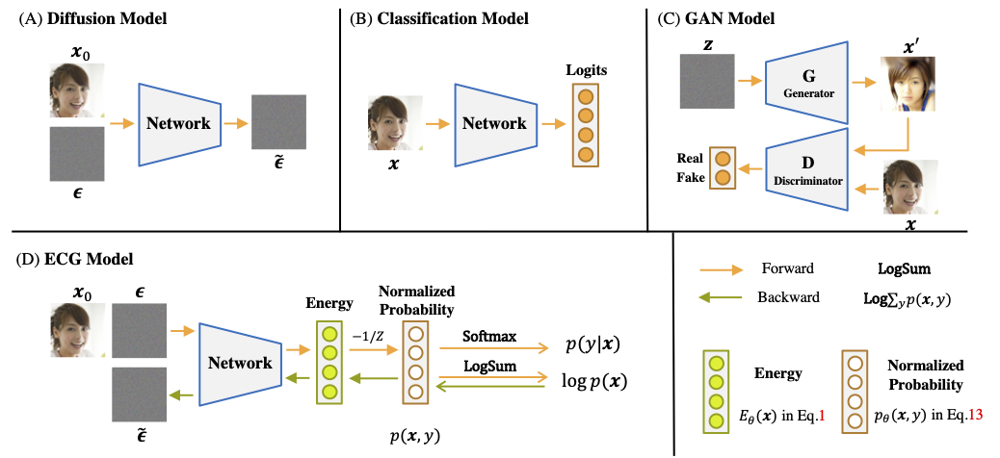

# EGC: Image Generation and Classification via a Diffusion Energy-Based Model

#### <p align="center"><a href="https://guoqiushan.github.io/egc.github.io/">Project Page</a> | <a href="https://arxiv.org/abs/2304.02012">Paper</a> | <a href="https://arxiv.org/abs/2304.02012">ArXiv</a></p>



### Code is coming soon.


If you find EGC useful for your work, please cite:

```bibtex
@article{guo2023egc,
  title={EGC: Image Generation and Classification via a Single Energy-Based Model},
  author={Guo, Qiushan and Ma, Chuofan and Jiang, Yi and Yuan, Zehuan and Yu, Yizhou and Luo, Ping},
  journal={arXiv preprint arXiv:2304.02012},
  year={2023}
}
```
